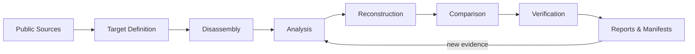

<div align="center">

# DISASSEMBLY

**Reverse Engineering · Binary Analysis · Code Reconstruction · Verification**

[](https://github.com/SakuraiTsubaki/Disassembly/actions/workflows/build.yml)
[](https://github.com/SakuraiTsubaki/Disassembly/actions/workflows/test.yml)
[](https://github.com/SakuraiTsubaki/Disassembly/actions/workflows/verify.yml)
[](https://github.com/SakuraiTsubaki/Disassembly/actions/workflows/pages.yml)

*A reusable, reproducible workspace for disassembly and reverse-engineering research.*

</div>

---

## Overview

`Disassembly` is a general-purpose foundation for binary disassembly, reverse engineering, code reconstruction, documentation, analysis, comparison, and reproducible verification.

The repository keeps target-specific reconstruction separate from shared tooling, research notes, schemas, tests, reports, manifests, and automation so that every result can be traced and reproduced.

## Project map

| Area | Purpose | Status |
| --- | --- | :---: |
| [`docs/`](docs/) | Methodology, architecture, formats, memory maps, references | 🟢 Active |
| [`toolchains/`](toolchains/) | Tool installation, configuration, and version tracking | 🟡 Scaffolded |
| [`emulators/`](emulators/) | Emulator configuration and verification automation | 🟡 Scaffolded |
| [`scripts/`](scripts/) | Setup, disassembly, analysis, comparison, verification, utilities | 🟡 Scaffolded |
| [`targets/`](targets/) | Target-specific disassembly workspaces | 🟡 Ready |
| [`schemas/`](schemas/) | Machine-readable symbol, manifest, and report schemas | 🟡 Ready |
| [`tests/`](tests/) | Unit, integration, and regression verification | 🟡 Ready |
| [`reports/`](reports/) | Analysis, comparison, and verification reports | 🟡 Ready |
| [`manifests/`](manifests/) | Source provenance, tool versions, checksums | 🟡 Ready |
| [`.github/`](.github/) | CI, issue templates, pull-request workflow, Pages | 🟢 Active |

**Legend:** 🟢 active · 🟡 framework ready · 🔵 verified target · ⚪ planned

## Workflow



1. Identify the target and document public reference material.
2. Record architecture, file-format, memory-map, and toolchain requirements.
3. Disassemble and classify code/data regions.
4. Reconstruct labels, symbols, structures, and source organization.
5. Compare reconstruction results against reproducible reference criteria.
6. Verify outputs, record checksums, and publish reports/manifests.

Detailed methodology lives in [`docs/methodology/`](docs/methodology/).

## Target workspace

Each target follows the same layout:

```text
targets/<TARGET>/
├─ README.md
├─ config/
├─ include/
├─ src/
├─ data/
├─ symbols/
├─ maps/
├─ analysis/
├─ references/
├─ tests/
└─ verification/
```

See [`targets/README.md`](targets/README.md) for status conventions and target registration rules.

## Toolchain matrix

| Tool | Primary role | Repository area |
| --- | --- | --- |
| RGBDS | Game Boy / Game Boy Color assembly and analysis workflows | `toolchains/rgbds/` |
| GNU Binutils | Generic assembler, linker, object and binary utilities | `toolchains/binutils/` |
| LLVM | Disassembly/compiler infrastructure and binary utilities | `toolchains/llvm/` |
| Ghidra | Static analysis and reverse engineering | `toolchains/ghidra/` |
| radare2 | Command-line binary analysis and scripting | `toolchains/radare2/` |

Tool versions and target-specific requirements must be recorded rather than assumed. See [`toolchains/README.md`](toolchains/README.md).

## Documentation

- [`docs/methodology/disassembly-workflow.md`](docs/methodology/disassembly-workflow.md) — end-to-end workflow
- [`docs/methodology/reverse-engineering.md`](docs/methodology/reverse-engineering.md) — research principles
- [`docs/methodology/naming-conventions.md`](docs/methodology/naming-conventions.md) — naming rules
- [`docs/methodology/verification.md`](docs/methodology/verification.md) — verification requirements
- [`docs/STYLE_GUIDE.md`](docs/STYLE_GUIDE.md) — repository-wide documentation style
- [`docs/references/README.md`](docs/references/README.md) — source/provenance rules

## Reports & Pages

Research output belongs in [`reports/`](reports/). The Pages workflow publishes the repository's report portal from [`site/`](site/) so reports can be browsed without digging through the tree.

## Binary policy

Original proprietary binaries and ROM images are not stored in this repository. Publicly distributable source code, scripts, configuration, documentation, metadata, manifests, checksums, and research outputs may be tracked.

## Contributing

Changes should be reproducible, traceable, and verifiable. Read [`CONTRIBUTING.md`](CONTRIBUTING.md) before adding a target, changing tooling, or publishing analysis.

## Changelog

Repository-level changes are recorded in [`CHANGELOG.md`](CHANGELOG.md).

---

<div align="center">

**DISASSEMBLE → ANALYZE → RECONSTRUCT → COMPARE → VERIFY**

</div>
