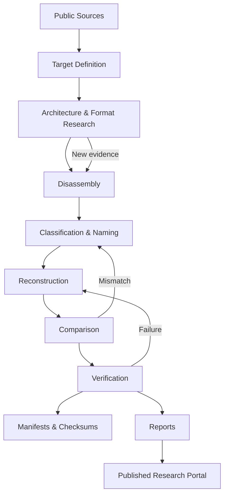

# Workflow

The repository follows a staged research process. A target may loop backward whenever new evidence changes an earlier interpretation.

## Stage gates

### 1. Target definition

Document identity, scope, architecture, public references, and expected outputs.

### 2. Architecture & format research

Record instruction-set details, memory layout, file/container formats, compression, or target-specific conventions needed to interpret the binary.

### 3. Disassembly

Produce raw or structured disassembly without silently assigning speculative semantics.

### 4. Classification & naming

Separate code, data, tables, pointers, text, graphics metadata, padding, unknown regions, and other classes. Promote names only as evidence supports them.

### 5. Reconstruction

Convert established findings into maintainable source, includes, data definitions, symbols, maps, and configuration.

### 6. Comparison

Compare reconstructed results against reference structure, behavior, bytes, hashes, or other explicit criteria.

### 7. Verification

Run deterministic checks and document what counts as success. Verification criteria may differ by target but must be reproducible.

### 8. Publication

Update reports, provenance records, checksums, and status tables. Verified conclusions should remain linked to the evidence that supports them.
